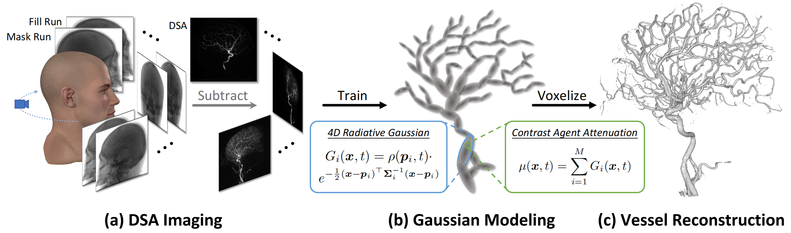

# 4DRGS: 4D Radiative Gaussian Splatting for Efficient 3D Vessel Reconstruction from Sparse-View Dynamic DSA Images
[Zhentao Liu](https://zhentao-liu.github.io/)\*, [Ruyi Zha](https://ruyi-zha.github.io/)\*, Huangxuan Zhao, [Hongdong Li](https://users.cecs.anu.edu.au/~hongdong/), and [Zhiming Cui](https://shanghaitech-impact.github.io/)

## [Arxiv](https://arxiv.org/abs/2412.12919) | [Project Page](https://shanghaitech-impact.github.io/4DRGS/)

Code for **IPMI 2025 Oral** paper.
We present 4DRGS, the first Gaussian splatting-based framework for efficient 3D vessel reconstruction from sparse-view dynamic DSA images. Our method achieves impressive results with sparse input (30 views) in minutes, highlighting its potential to support real-world medical assessment while reducing radiation exposure.

## Setup
First clone this repo. And then set up an environment and install packages. We use single RTX3090 for experiments.

    git clone https://github.com/ShanghaiTech-IMPACT/4DRGS.git
    cd 4DRGS
    conda env create -f environment.yml
    conda activate 4DRGS
    wget https://github.com/CERN/TIGRE/archive/refs/tags/v2.4.zip
    unzip v2.4.zip
    pip install TIGRE-2.4/Python --no-build-isolation
    
## Data-Preparation
We provide `case2` in our paper, and you can find it in this [data link](https://drive.google.com/drive/folders/1vNnNfgAFzntEOZIhjm3PRMGh-1Vf2GeR?usp=sharing), including fill run, mask run, reference reconstructed volume from DSA scanner, reference mesh, and geometry description json file.
You may use it for quick validation.

# Training
After downloading the data, you could run the following command to train your model.

    python train.py -m=output/case2_30v_30k -s=./dataset/case2 --Nviews=30

In this way, you would train a model with 30 input views on case2 for 30k iteration, finished in tens of minutes. You can also train a fast version in several minutes as follows.

    python train.py -m=output/case2_30v_10k -s=./dataset/case2 --Nviews=30 --iteration=10000 --ADC_until_iter=5000

## Testing
Use the following commands to test your trained model. It would conduct multi-view rendering, fix-view rendering, and 3D vessel reconstruction.

    python test.py -m=output/case2_30v_30k -s=./dataset/case2 --Nviews=30 --render_2d --render_fixview --VQR
    python test.py -m=output/case2_30v_10k -s=./dataset/case2 --Nviews=30 --iteration=10000 --render_2d --render_fixview --VQR

## Related Links
- Traditional FDK reconstruction is implemented based on [TIGRE-toolbox](https://github.com/CERN/TIGRE)
- The first 3DGS-based framework for CT reconstruction: [R2-Gaussian](https://github.com/Ruyi-Zha/r2_gaussian)
- The first 3DGS-based framework for DSA image synthesis: [TOGS](https://github.com/hustvl/TOGS)
- NeRF-based framework for DSA reconstruction: [VPAL](https://arxiv.org/abs/2405.10705), [TiAVox](https://arxiv.org/abs/2309.02318)
- It is recommended to observe medical data in nii format with [ITK-SNAP](http://www.itksnap.org/pmwiki/pmwiki.php/) or [3D Slicer](https://www.slicer.org/).

Our method is developed based on the amazing open-source code: [3DGS](https://github.com/graphdeco-inria/gaussian-splatting) and [R2-Gaussian](https://github.com/Ruyi-Zha/r2_gaussian).

Thanks for all these great works.

## Contact
There may be some errors during code cleaning. If you have any questions on our code or our paper, please feel free to contact with the author: liuzht2022@shanghaitech.edu.cn, or raise an issue in this repo. We shall continue to update this repo. TBC.

## Citation
If you think our work and repo are useful, you may cite our paper.

    @article{4DRGS,
      title={4DRGS: 4D Radiative Gaussian Splatting for Efficient 3D Vessel Reconstruction from Sparse-View Dynamic DSA Images},
      author={Liu, Zhentao and Zha, Ruyi and Zhao, Huangxuan and Li, Hongdong and Cui, Zhiming},
      journal={arXiv preprint arXiv:2412.12919},
      year={2024}
    }
