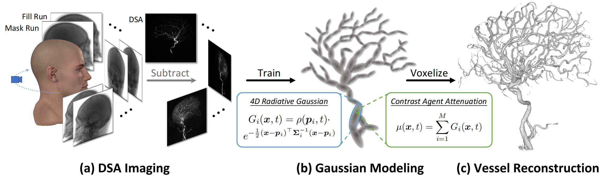

# 4DRGS: 4D Radiative Gaussian Splatting for Efficient 3D Vessel Reconstruction from Sparse-View Dynamic DSA Images
[Zhentao Liu](https://zhentao-liu.github.io/)\*, [Ruyi Zha](https://ruyi-zha.github.io/)\*, Huangxuan Zhao, [Hongdong Li](https://users.cecs.anu.edu.au/~hongdong/), and [Zhiming Cui](https://shanghaitech-impact.github.io/)

## [Arxiv](https://arxiv.org/abs/2412.12919) | [Project Page](https://shanghaitech-impact.github.io/4DRGS/)

Code for **IPMI 2025 Oral** paper.
We present 4DRGS, the first Gaussian splatting-based framework for efficient 3D vessel reconstruction from sparse-view dynamic DSA images. Our method achieves impressive results with sparse input (30 views) in minutes, highlighting its potential to support real-world medical assessment while reducing radiation exposure.

## Updated Feature
- **[2026-08-24]** We introduce sort-free X-ray rasterization, which removes unnecessary depth sorting for additive X-ray line-integral accumulation. On case2 with 30 input views, it reduces runtime by 14.9%--15.4% (1.17x--1.18x speedup) on a local NVIDIA RTX 4060 Ti while maintaining comparable PSNR and SSIM.
- **[2025-11-09]** We now support [LEAP toolbox](https://github.com/LLNL/leap) for FDK reconstruction. [TIGRE toolbox](https://github.com/CERN/TIGRE) may encounter a CUDA error as reported in [issue #3](https://github.com/ShanghaiTech-IMPACT/4DRGS/issues/3#issue-3094309948). You can select the desired toolbox in `arguments/__init__.py` via `ModelParams.fdk_toolbox`.
- **[2025-08-07]** tiny-cuda-nn now comes with a just-in-time (JIT) compilation mode. We have updated this feature in `scene/field.py` by setting `model.jit_fusion = tcnn.supports_jit_fusion()`, which provides some speed improvements. Note that `tinycudann>=2.0` is required. Results in our paper is reported with `tinycudann==1.7`.

## Sort-free X-ray rasterization
X-ray rasterization in 4DRGS is an additive line-integral accumulation, so its result does not depend on the depth order of Gaussians. In contrast, the original 3DGS uses depth sorting for order-dependent alpha compositing. The sort-free backend removes tile duplication, prefix-sum, and depth-sorting stages. It is the default backend; the original implementation remains available for comparison:

    --rasterizer_backend sort_free  # default
    --rasterizer_backend legacy

The following results were measured locally on case2 with 30 input views and an NVIDIA RTX 4060 Ti:

| Iterations / ADC until | Backend | Runtime (s) | Iteration/s | ms/iteration | Eval PSNR | Eval SSIM |
| --- | --- | ---: | ---: | ---: | ---: | ---: |
| 10k / 5k | Legacy | 453.10 | 22.07 | 45.31 | 36.343 | 0.9026 |
| 10k / 5k | Sort-free | 383.51 | 26.07 | 38.35 | 36.349 | 0.9021 |
| 30k / 15k | Legacy | 1380.66 | 21.73 | 46.02 | 36.343 | 0.9032 |
| 30k / 15k | Sort-free | 1175.09 | 25.53 | 39.17 | 36.407 | 0.9031 |

The runtime reported in the paper was measured on an NVIDIA RTX 3090.

## Setup
First clone this repo. And then set up an environment and install packages. C++ Compiler is required. We used Visual Studio 2019 for Windows and GCC 8.3.0 for Linux.

    git clone https://github.com/ShanghaiTech-IMPACT/4DRGS.git
    cd 4DRGS
    conda create -n 4DRGS python=3.8
    conda activate 4DRGS
    pip install torch==2.1.2+cu118 torchvision==0.16.2+cu118 --extra-index-url https://download.pytorch.org/whl/cu118
    pip install -r requirements.txt
    git clone https://github.com/CERN/TIGRE.git
    cd TIGRE
    pip install .
    cd ..
    git clone --recursive https://github.com/nvlabs/tiny-cuda-nn
    cd tiny-cuda-nn/bindings/torch
    python setup.py install
    cd ../../..
    pip install submodules/diff-Xray-gaussian-rasterization-voxelization-sortfree
    pip install submodules/diff-Xray-gaussian-rasterization-voxelization-legacy
    pip install submodules/simple-knn

Please refer to [LEAP toolbox](https://github.com/LLNL/leap) for your best installation. The following is what I do.

    git clone https://github.com/LLNL/LEAP.git
    cd LEAP
    
    ## for windows user ##
    .\etc\win_build.bat
    copy /y .\win_build\bin\Release\libleapct.dll.
    ## for linux user ##
    sh ./etc/build.sh
    cp ./build/lib/libleapct.so .
    
    python manual_install.py
    

## Data-Preparation
We provide `case2` in our paper, and you can find it in this [data link](https://drive.google.com/drive/folders/1vNnNfgAFzntEOZIhjm3PRMGh-1Vf2GeR?usp=sharing), including fill run, mask run, reference reconstructed volume from DSA scanner, reference mesh, and geometry description json file.
You may use it for quick validation.

# Training
After downloading the data, you could run the following command to train your model.

    python train.py -m=output/case2_30v_30k -s=./dataset/case2 --Nviews=30

In this way, you would train a model with 30 input views on case2 for 30k iteration, finished in tens of minutes. You can also train a fast version in several minutes as follows.

    python train.py -m=output/case2_30v_10k -s=./dataset/case2 --Nviews=30 --iteration=10000 --ADC_until_iter=5000

## Testing
Use the following commands to test your trained model. It would conduct multi-view rendering, fix-view rendering, and 3D vessel reconstruction.

    python test.py -m=output/case2_30v_30k -s=./dataset/case2 --Nviews=30 --render_2d --render_fixview --VQR
    python test.py -m=output/case2_30v_10k -s=./dataset/case2 --Nviews=30 --iteration=10000 --render_2d --render_fixview --VQR

## Related Links
- Traditional FDK reconstruction is implemented based on [TIGRE toolbox](https://github.com/CERN/TIGRE) and [LEAP toolbox](https://github.com/LLNL/leap)
- The first 3DGS-based framework for CT reconstruction: [R2-Gaussian](https://github.com/Ruyi-Zha/r2_gaussian)
- The first 3DGS-based framework for DSA image synthesis: [TOGS](https://github.com/hustvl/TOGS)
- NeRF-based framework for DSA reconstruction: [VPAL](https://arxiv.org/abs/2405.10705), [TiAVox](https://arxiv.org/abs/2309.02318)
- It is recommended to observe medical data in nii format with [ITK-SNAP](http://www.itksnap.org/pmwiki/pmwiki.php/) or [3D Slicer](https://www.slicer.org/).

Our method is developed based on the amazing open-source code: [3DGS](https://github.com/graphdeco-inria/gaussian-splatting) and [R2-Gaussian](https://github.com/Ruyi-Zha/r2_gaussian).

Thanks for all these great works.

## Contact
There may be some errors during code cleaning. If you have any questions on our code or our paper, please feel free to contact with the author: liuzht2022@shanghaitech.edu.cn, or raise an issue in this repo. We shall continue to update this repo. TBC.

## Citation
If you think our work and repo are useful, you may cite our paper.

    @inproceedings{4DRGS,
      title={4DRGS: 4D radiative gaussian splatting for efficient 3D vessel reconstruction from sparse-view dynamic DSA images},
      author={Liu, Zhentao and Zha, Ruyi and Zhao, Huangxuan and Li, Hongdong and Cui, Zhiming},
      booktitle={International Conference on Information Processing in Medical Imaging},
      pages={361--374},
      year={2025},
      organization={Springer}
    }

